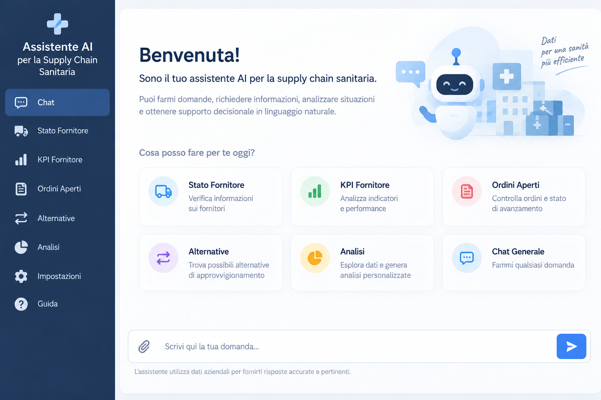

# Healthcare Supply Chain AI Assistant

A privacy-conscious, locally deployed conversational AI system for healthcare
supply-chain decision support, combining a local Large Language Model,
Retrieval-Augmented Generation (RAG), hybrid SQL/vector retrieval, intelligent
query routing, and operational analytics.

<p align="center">
  
</p>

<p align="center">
  <em>
   Conceptual illustration of the implemented system’s interface, recreated for public portfolio presentation. The underlying system is fully implemented; only the interface shown here has been redesigned to avoid exposing real operational data, the production interface, or organization-specific information.
  </em>
</p>

---

## Overview

This project presents the architecture of a locally deployed conversational AI
assistant designed to support information access, analysis, and decision-making
in a healthcare supply-chain context.

The system enables users to interact with structured and unstructured
information through natural language while automatically selecting an
appropriate retrieval or processing strategy.

It combines:

- Local Large Language Model inference
- Structured SQL-based retrieval
- Retrieval-Augmented Generation (RAG)
- Embedding-based semantic retrieval
- Vector search with ChromaDB
- Intelligent query routing
- Specialized query and analysis components
- Operational analytics
- Conversational interaction

The architecture is designed around local processing and privacy-conscious AI
deployment.

---

## System Architecture

The system uses a hybrid retrieval architecture that combines structured
database access with semantic vector retrieval.

```text
                    Operational Information
                              │
                              ▼
                    Processing & Integration
                              │
                 ┌────────────┴────────────┐
                 │                         │
                 ▼                         ▼
              SQLite                   Embeddings
                 │                         │
                 ▼                         ▼
        Structured Retrieval           ChromaDB
                 │                         │
                 │                         ▼
                 │                Semantic Retrieval
                 │                         │
                 └────────────┬────────────┘
                              │
                              ▼
                         Query Router
                              │
                              ▼
                 Specialized Components
                              │
                              ▼
                     Retrieved Context
                              │
                              ▼
                Qwen2.5-Coder-3B-Instruct
                              │
                         LM Studio
                              │
                              ▼
                  Conversational Assistant
                              │
                              ▼
                       Decision Support
```

The routing layer determines which retrieval or analytical strategy is most
appropriate for each user request.

---

## Conversational AI

The system provides a conversational interface for interacting with information
through natural language.

Rather than requiring users to manually navigate structured information or
construct database queries, the assistant interprets incoming requests and
routes them through the appropriate processing pipeline.

Depending on the request, the system can use:

- Structured database retrieval
- Semantic vector retrieval
- Retrieval-Augmented Generation
- Analytical processing
- Specialized query components
- General conversational interaction

The results are integrated into a unified conversational experience.

---

## Intelligent Query Routing

A routing mechanism is used to classify incoming requests and select the
appropriate processing strategy.

```text
                     User Request
                          │
                          ▼
                     Query Router
                          │
          ┌───────────────┼───────────────┐
          │               │               │
          ▼               ▼               ▼
     Structured        Semantic        Analytical
      Retrieval        Retrieval       Processing
          │               │               │
          ▼               ▼               ▼
       SQLite           ChromaDB        Specialized
                                          Components
          │               │               │
          └───────────────┴───────────────┘
                          │
                          ▼
                      Local LLM
                          │
                          ▼
                       Response
```

This modular approach allows deterministic retrieval, semantic search, and
LLM-based interaction to coexist within the same application.

---

## Retrieval-Augmented Generation (RAG)

The system implements a Retrieval-Augmented Generation pipeline to ground
language-model responses in retrieved information.

Instead of relying exclusively on the model's internal knowledge, relevant
context is retrieved from the local information environment before response
generation.

The RAG workflow follows:

```text
User Query
    │
    ▼
Query Embedding
    │
    ▼
Semantic Similarity Search
    │
    ▼
ChromaDB Vector Store
    │
    ▼
Relevant Context Retrieval
    │
    ▼
Context-Augmented Prompt
    │
    ▼
Local LLM
    │
    ▼
Grounded Response
```

This architecture enables the assistant to retrieve semantically relevant
information even when the user's wording does not exactly match the terminology
of the indexed content.

---

## Embedding-Based Retrieval

Information used by the RAG pipeline is represented through vector embeddings
and indexed in **ChromaDB**.

Incoming user queries are converted into embedding representations and compared
against the vector store through semantic similarity search.

The most relevant retrieved context is then provided to the local language
model during response generation.

This provides semantic information access beyond exact keyword matching.

---

## Hybrid SQL + Vector Retrieval

The system combines two complementary retrieval mechanisms.

### Structured Retrieval — SQLite

SQLite is used when a request requires precise, deterministic access to
structured information.

This approach is appropriate for exact values, filters, structured attributes,
and database-oriented queries.

### Semantic Retrieval — ChromaDB

ChromaDB is used when a request benefits from semantic similarity and
contextual retrieval.

Embedding-based search allows relevant information to be identified based on
meaning rather than exact lexical matching.

### Hybrid Strategy

The routing layer determines which strategy is appropriate for the incoming
request.

```text
Natural-Language Query
          │
          ▼
      Query Router
          │
     ┌────┴────┐
     │         │
     ▼         ▼
   SQLite    ChromaDB
     │         │
     ▼         ▼
Structured   Semantic
 Context     Context
     │         │
     └────┬────┘
          │
          ▼
      Local LLM
          │
          ▼
       Response
```

This allows structured database operations and semantic retrieval to complement
each other within the same conversational system.

---

## Local Large Language Model

The conversational assistant is powered by:

**Qwen2.5-Coder-3B-Instruct (MLX)**

with local model serving through **LM Studio**.

The model operates locally as part of the application pipeline and interacts
with context produced by the retrieval and analytical components.

Local deployment supports:

- Local LLM inference
- Greater control over data processing
- Integration with local databases and retrieval systems
- Reduced dependency on external AI services
- Privacy-conscious AI workflows

---

## Specialized Components

The architecture incorporates specialized components for different categories
of information requests.

These components support:

- Precise structured information retrieval
- Semantic information retrieval
- Analytical queries
- Information aggregation
- Context construction
- General conversational interaction

A routing layer coordinates these components and selects the appropriate
processing path according to the user's request.

The detailed internal workflows and organization-specific business logic are
intentionally outside the scope of this repository.

---

## Analytics & Decision Support

The system incorporates analytical and decision-support functionality in
addition to conversational information retrieval.

Structured information can be processed through dedicated analytical components
before relevant results are returned through the conversational interface.

The implementation of organization-specific decision rules, parameters,
thresholds, and internal operational logic is intentionally not disclosed.

---

## User Interface

The system is integrated into an interactive application developed with
**Streamlit**.

The interface provides a unified environment for:

- Natural-language interaction
- Structured information retrieval
- Semantic search
- Retrieval-Augmented Generation
- Analytical queries
- Decision-support interaction

The image shown at the beginning of this README is a conceptual illustration
created specifically for portfolio presentation.

It is not a screenshot of the production application.

---

## Privacy-Conscious Architecture

Privacy is a central architectural consideration.

The main AI and retrieval components are designed to operate locally:

```text
┌────────────────── Local Environment ──────────────────┐
│                                                       │
│                Local Information                      │
│                       │                               │
│          ┌────────────┴────────────┐                  │
│          │                         │                  │
│        SQLite                   ChromaDB              │
│          │                         │                  │
│          └────────────┬────────────┘                  │
│                       │                               │
│                      RAG                              │
│                       │                               │
│                  Local LLM                            │
│                       │                               │
│                  Application                          │
│                                                       │
└───────────────────────────────────────────────────────┘
```

This design minimizes the need to transmit operational information to external
LLM providers.

---

## Technology Stack

### AI & NLP

- Qwen2.5-Coder-3B-Instruct
- MLX
- LM Studio
- Local LLM inference
- Conversational AI

### Retrieval

- Retrieval-Augmented Generation (RAG)
- Embedding-based semantic retrieval
- ChromaDB
- Vector similarity search
- Hybrid SQL + vector retrieval

### Data & Backend

- Python
- SQLite
- Pandas
- Structured data processing

### Application

- Streamlit

### Architecture

- Intelligent query routing
- Specialized query components
- Structured retrieval
- Semantic retrieval
- Context-augmented generation
- Operational analytics
- Decision-support workflows

---

## Technical Contributions

The project involved the design and implementation of an end-to-end applied AI
workflow covering:

- Data preprocessing and integration
- Structured data management with SQLite
- Local LLM deployment and integration
- Conversational AI workflow design
- Specialized query and analysis components
- Intelligent query routing
- Retrieval-Augmented Generation
- Embedding-based semantic retrieval
- ChromaDB vector-store integration
- Hybrid SQL and vector retrieval
- Analytical and decision-support components
- Streamlit application development
- Privacy-conscious local AI architecture

---

## Project Implementation & Repository Scope

This project represents a fully implemented AI system developed for a real-world
healthcare supply-chain environment.

I designed and implemented the end-to-end system, including data processing,
SQLite-based structured retrieval, local LLM integration, intelligent query
routing, specialized query and analytical components, Retrieval-Augmented
Generation (RAG), embedding-based semantic retrieval with ChromaDB, hybrid
SQL/vector retrieval, and the Streamlit conversational interface.

Due to the confidential nature of the operational environment, this public
repository serves as a technical portfolio and architecture overview rather
than a distribution of the production implementation.

The production source code, operational datasets, databases, vector-store
contents, internal prompts, real application screenshots, organization-specific
workflows, business rules, and operational information are intentionally not
published.

The architecture and technologies described in this repository reflect the
implemented system, while the interface image shown above is a conceptual
illustration created specifically for public portfolio presentation.

---


## Author

**Neda Jamshidi**

PhD Researcher in Artificial Intelligence & Natural Language Processing  
Department of Information Engineering and Mathematics (DIISM)  
University of Siena, Italy
                
                            
